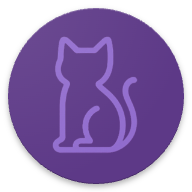

# CatBreeds App 🐱

<p align="center">
    
    <p align="center">Explora el fascinante mundo de las razas felinas</p>
</p>

[](https://reactnative.dev/)
[](https://www.typescriptlang.org/)
[](https://tanstack.com/query/latest)
[](https://reactnavigation.org/)
[](https://docs.swmansion.com/react-native-reanimated/docs/fundamentals/getting-started/)
[](https://axios-http.com/es/docs/intro)
[](https://bun.sh/)
[](https://bun.sh/)
[](https://www.npmjs.com/)
[](https://yarnpkg.com/)
[](https://github.com/oblador/react-native-vector-icons/tree/master)
[](https://developers.thecatapi.com/)


## Aplicación móvil desarrollada con React Native para explorar razas de gatos, ver características detalladas y buscar razas específicas usando [TheCatAPI](https://developers.thecatapi.com/).

---

## 📚 Documentación Generada

La documentación técnica completa del proyecto, generada automáticamente con [Deepwiki](https://deepwiki.com/).
Consulta esta sección para detalles sobre la arquitectura, componentes, hooks y flujos internos de la app.

- [Ver documentación Deepwiki](https://deepwiki.com/DevACampuzano/CatBreeds)

---

## 📸 Demo de la App

<div style="display:flex;gap:20px;justify-content: center; align-items:center">
  <div style="display:flex;gap:20px;justify-content: center; align-items:center; flex-direction:column">
    <span style="font-size: 20px; font-weight:bold;">iOS</span>
    
  </div>
  <div style="display:flex;gap:20px;justify-content: center; align-items:center; flex-direction:column">
    <span style="font-size: 20px; font-weight:bold">Android</span>
    
  </div>
</div>
<br/>
<br/>
Disfruta de una vista rápida de las principales funcionalidades: exploración de razas, búsqueda, detalles y animaciones.

---

## 🚀 Características

- Explora un listado completo de razas de gatos
- SBusca razas por nombre
- Visualiza información detallada (Inteligencia, esperanza de vida, adaptabilidad, etc.)
- Interfaz atractiva con animaciones fluidas
- Scroll infinito para el listado de razas
- Funcionalidad offline gracias al caché de React Query

---

## 📦 Instalación

### Requisitos previos

- Node.js (v18+)
- npm / Yarn
- bun (opcional)
- React Native CLI
- Android Studio / Xcode (para emuladores)

### Setup

1. Clona el repositorio:

   ```bash
   git clone https://github.com/devacampuzano/catbreeds.git
   cd catbreeds
   ```

2. instala las dependecias:

   ```bash
   npm install
   # o
   yarn
   # o
   bun install
   ```

3. Ejecuta la app:

   - android:

     ```bash
     npx react-native run-android
     # o
     bun android
     ```

   - iOS:

     ```bash
     npx react-native run-ios
     # o
     bun ios
     ```

---

## 📂 Estructura del proyecto

```
    catbreeds/
    ├── src/
    │   ├── components/       # Componentes reutilizables (Tarjetas, Búsqueda, Estrellas, etc.)
    │   ├── screens/          # Pantallas (home, details)
    │   ├── common/
    │   │   ├── api/          # Configuración de API (TheCatAPI)
    │   │   ├── hooks/        # Hooks personalizados (useBreeds, useDebounce)
    │   │   ├── store/        # Gestión de estado
    │   │   └── assets/       # Fuentes, imágenes
    │   ├── routes/           # Configuración de navegación
    │   ├── service/          # Acciones de API
    │   └── styles/           # Temas globales
```

---

## 🔨 Tecnologías Utilizadas

- React Native (v0.80)
- TypeScript
- React Navigation (V7)
- React Query (TanStack) - Consulta y caché de datos
- React Native Reanimated - Animaciones
- Axios - Preticiones HTTP
- React Native Vector Icons (ionicons) - paquete de iconos

---

## <span style="display: inline-flex; align-items: center; gap: 8px;"><svg xmlns="http://www.w3.org/2000/svg" height="24px" viewBox="0 -960 960 960" width="24px" fill="#ffff"><path d="M320-240 80-480l240-240 57 57-184 184 183 183-56 56Zm320 0-57-57 184-184-183-183 56-56 240 240-240 240Z"/></svg>Fragmeentos de Código</span>

### 1. Obtención de rezas con scroll infinito

```ts
// src/common/hooks/useBreeds.ts
const {
  data: { pages: listPages },
  fetchNextPage,
  hasNextPage,
  isFetchingNextPage,
  isLoading: isLoadingBreeds,
} = useInfiniteQuery({
  queryKey: ["breeds-list"],
  queryFn: ({ pageParam = 0, signal }) =>
    BreedsActions.getBreeds(6, pageParam, signal),
  getNextPageParam: (_, allPages) => allPages.length,
  initialPageParam: 0,
  staleTime: 1000 * 60 * 60,
});
```

### 2. Búsqueda con debounce

```ts
// src/common/hooks/useBreeds.ts
const {
  data: listFiltered = [],
  isLoading: isLoadingFiltered,
  refetch,
} = useQuery({
  queryKey: ["breeds-list", searchQuery],
  queryFn: ({ signal }) =>
    BreedsActions.getSearchBreeds(searchQuery.trim(), signal),
  enabled: !!searchQuery,
  staleTime: 1000 * 60 * 60,
});

const debouncedRefetch = useDebounce(refetch, 500);

const handleChangeSearchText = useCallback(
  (search: string) => {
    setSearchQuery(search);
    debouncedRefetch();
  },
  [debouncedRefetch]
);
```

### 3. Animaciones de compontes

- Componente CatCard

  ```js
  // src/components/CatCard/index.tsx
  ```

  ```hbs
  <Animated.View
    entering={index 6 ? FadeInDown.delay( 200* index) : undefined}
  ></Animated.View>
  ```

- Componente Section
  ```js
  // src/components/Section/index.tsx
  ```
  ```hbs
  <Animated.View
    style={styles.section}
    entering={FadeInDown.delay( 300 * index)}
  ></Animated.View>
  ```

---

## 🎨 Componentes de UI

- CatCard: Tarjeta con imagen, nombre y intelgencia de la raza
- Stars: Puntuación con estrellas interactivas
- InputSearch: Barra de búsqueda
- Section: Secciones plegables en pantalla de detalles

---

## 📡 Integración con API

La app usa los endpoints de [TheCatAPI](https://developers.thecatapi.com/)

| Endpoint         | Método | Descripción                                   |
| ---------------- | ------ | --------------------------------------------- |
| `/breeds`        | GET    | Obtiene el listado por paginado de las razas  |
| `/breeds/search` | GET    | Busca razas por nombre                        |
| `/breeds/{id}`   | GET    | Obtiene detalles específicos de una raza      |
| `/images/{id}`   | GET    | Obtiene imágenes de referencia para las razas |

---

## 🛠️ Roadmap y Mejoras Futuras

- Implementar favoritos localmente
- Añadir comparador de razas
- Internacionalización / Multilenguaje (i18n)
- Modo oscuro

---

## 🙏 Agradecimientos

Agradezco a Pragma por la oportunidad de presentar esta prueba técnica y demostrar mis habilidades en desarrollo móvil. Ha sido un reto enriquecedor y valioso para mi crecimiento profesional.
